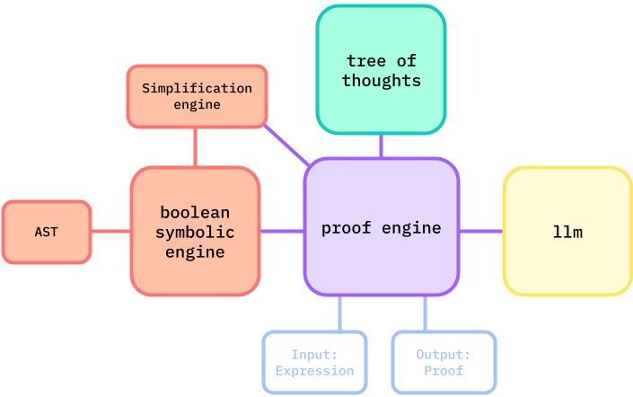

# Guide

<div align="center">
    
</div>


Logical equivalence symbolic engine guided by tree-of-thoughts 


## Setup
```bash
python3 -m venv venv
source venv/bin/activate
pip install -r requirements.txt
# ANTHROPIC_API_KEY=<your-api-key-here> (add this into .env file)
```

## Roadmap

- [x] Build symbolic engine
    - [x] expression to AST representation
    - [x] implement common laws on the AST
    - [ ] complete all logical rules
        - [ ] implication and bi-conditional laws
        - [ ] simplifications laws like "Zero and One" Law, Identity Law, double negation
    - [ ] fix idempotent bug
    - [ ] simplify AST at each step
- [x] Build prompt engine
    - [x] use the engine to collect all the logical prompts
    - [x] and feed it to the LM
    - [x] complete loop from llm choice back to prompt engine
    - [x] track entire history of selections
        - [x] expressions
        - [x] laws it chose
- [ ] boolean tree of thoughts
    - [x] integrate original repo
    - [ ] Set up boolean task
    - [ ] Option for GPT-3.5 Turbo or Claude-3 Haiku
- [ ] Write testcases
- [ ] Set up experiment suite to track model performances
- [ ] Start experimenting with how to improve ToT

## Example usage

Looks like the system works for simple expressions! This example uses ((x and x) or (x and x)) below (output not deterministic).

Command
```bash
python3 guide/prompt_engine.py --expr="(x and x) or (x and x)"
```

Output
```
Loading API keys...make sure to set them up in a .env file

----------PROOF STEP #1----------

CURRENT EXPR: (x and x) or (x and x)

Prompt:
'''original input expression: (x and x) or (x and x)
Choose one of the following that you think will best help you solve if this statement is a tautology. Generate thoughts about which logical law helps you most, then output 1 row, where the row is a selection of what law is best.#0., 'Commutative Law', '(x and x or x and x)'
#1., 'Commutative Law', '(x and x or x and x)'
#2., 'Commutative Law', '(x and x or x and x)'
#3., 'Distributive Law', '((x and x or x) and (x and x or x))'
#4., 'Idempotent Law', '(x and x or x)'
#5., 'Idempotent Law', '(x or x)'
#6., 'Idempotent Law', '(x or x)'
Respond with your best output like this at the VERY end:
My choice: #?. (? law)'''

LLM Response:
'''To determine if the given expression, (x and x) or (x and x), is a tautology, the Idempotent Law would be the most helpful.

The Idempotent Law states that for any proposition P, P and P is equivalent to P, and P or P is equivalent to P. In other words, the expression (x and x) is equivalent to x, and the expression (x or x) is equivalent to x.

Applying the Idempotent Law to the original expression, we get:
(x and x) or (x and x) = x or x = x

Since the expression simplifies to x, which is a tautology, the original expression (x and x) or (x and x) is also a tautology.

My choice: #4. (Idempotent Law)'''

----------PROOF STEP #2----------

CURRENT EXPR: (x and x or x)

Prompt:
'''original input expression: (x and x or x)
Choose one of the following that you think will best help you solve if this statement is a tautology. Generate thoughts about which logical law helps you most, then output 1 row, where the row is a selection of what law is best.#0., 'Commutative Law', '(x or x and x)'
#1., 'Commutative Law', '(x or x and x)'
#2., 'Distributive Law', '((x or x) and (x or x))'
#3., 'Idempotent Law', '(x and (x or x))'
#4., 'Idempotent Law', '(x and x)'
#5., 'Idempotent Law', 'x'
Respond with your best output like this at the VERY end:
My choice: #?. (? law)'''

LLM Response:
'''To determine if the given expression, (x and x or x), is a tautology, the Idempotent Law would be the most helpful logical law.

The Idempotent Law states that for any proposition x, the following are true:

x and x = x
x or x = x

Applying the Idempotent Law to the given expression, we get:

(x and x or x)
= (x or x)
= x

Since the expression simplifies to just x, it is a tautology, meaning it is always true regardless of the value of x.

My choice: #5. (Idempotent Law)'''

----------PROOF STEP #3----------

CURRENT EXPR: x
Expression 'x' cannot be further applied onto laws
----------FINAL PROOF----------
Proof:
(x and x) or (x and x)                Idempotent Law
≡ (x and x or x)                      Idempotent Law
≡ x
```

## Symbols

$$ T: \text{TRUE}$$

$$ F: \text{FALSE}$$

$$ \\: \text{AND}$$

$$ |: \text{OR}$$

$$ \sim : \text{NOT}$$

$$ \equiv: \text{Equivalence}$$

$$ \rightarrow: \text{Implication}$$

$$ \leftrightarrow: \text{Bi-Conditional}$$

$$ \\{a\dots z\\}: \text{Expression} $$

$$ A \uparrow B: \text{NAND} $$

$$ A \downarrow B: \text{NOR} $$

$$ A \odot B: \text{XNOR} $$


## Common Logic Laws

1. **Commutative Law**:
   - $A \land B = B \land A$
   - $A \lor B = B \lor A$

2. **Associative Law**:
   - $(A \land B) \land C = A \land (B \land C)$
   - $(A \lor B) \lor C = A \lor (B \lor C)$

3. **Distributive Law**:
   - $A \land (B \lor C) = (A \land B) \lor (A \land C)$
   - $A \lor (B \land C) = (A \lor B) \land (A \lor C)$

4. **Identity Law**:
   - $A \land 1 = A$; $A \land 0 = 0$
   - $A \lor 0 = A$; $A \lor 1 = 1$

5. **Negation Law**:
   - $A \land \lnot A = 0$ (contradiction)
   - $A \lor \lnot A = 1$ (tautology)

6. **Idempotent Law**:
   - $A \land A = A$
   - $A \lor A = A$

7. **Zero and One Law**:
   - $A \land 0 = 0$
   - $A \lor 1 = 1$

8. **Absorption Law**:
   - $A \land (A \lor B) = A$
   - $A \lor (A \land B) = A$

9. **De Morgan's Theorem**:
   - $\lnot (A \land B) = \lnot A \lor \lnot B$
   - $\lnot (A \lor B) = \lnot A \land \lnot B$

10. **Double Negation (Involution) Law**:
    - $\lnot (\lnot A) = A$

11. **Exclusive OR (XOR) Properties**:
    - $A \oplus B = (A \land \lnot B) \lor (\lnot A \land B)$
    - $A \oplus B = (A \lor B) \land \lnot (A \land B)$
    - $A \oplus 0 = A$
    - $A \oplus A = 0$

12. **Implication Transformation**:
    - $A \Rightarrow B = \lnot A \lor B$

13. **NAND and NOR Laws**:
    - $A \uparrow B = \lnot(A \land B)$
    - $A \downarrow B = \lnot(A \lor B)$

14. **Exclusive NOR (XNOR) Properties**:
    - $A \oplus B = \lnot(A \oplus B)$
    - $A \odot B = (A \land B) \lor (\lnot A \land \lnot B)$

16. **Consensus Theorem**:
    - $(A \land B) \lor (\lnot A \land C) \lor (B \land C) = (A \land B) \lor (\lnot A \land C)$

17. **Consensus Law**:
    - Removes a term when covered by a consensus
    - $(A \land B) \lor (\lnot B \land C) \lor (A \land C) = (A \land B) \lor (\lnot B \land C)$

18. **Adjacency Law**:
    - Simplifies expressions involving adjacent terms in a Karnaugh map or truth table
    - $(A \land B) \lor (A \land \lnot B) = A$

19. **Simplification Law**:
    - $(A \lor B) \land (A \lor \lnot B) = A$

20. **Implication Laws**:
    - $A \Rightarrow B = \lnot A \lor B$
    - $\lnot (A \Rightarrow B) = A \land \lnot B$

21. **Biconditional (iff) Laws**:
    - $A \Leftrightarrow B = (A \land B) \lor (\lnot A \land \lnot B)$
    - $\lnot (A \Leftrightarrow B) = A \oplus B$
